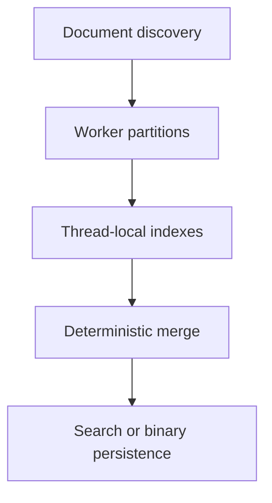

# C++ Search Engine

A dependency-free command-line search engine written in C++17. It recursively indexes local text and source-code files, stores positional posting lists, ranks multi-term queries with BM25, supports exact phrase search, and persists the index in a validated binary format.

The indexing pipeline supports both serial and parallel execution. Parallel workers build thread-local partial indexes that are merged deterministically, avoiding synchronization on the indexing hot path.

## Highlights

- Positional inverted index with document IDs, term frequencies, and token positions
- BM25 relevance ranking with document-length normalization
- Exact phrase search using positional adjacency checks
- Top-K retrieval using a bounded priority queue
- Contextual snippets around matched terms
- Recursive discovery of `.txt`, `.md`, `.cpp`, `.hpp`, `.c`, and `.h` files
- Binary index persistence with a file signature, format version, and validation
- Multithreaded indexing using independent thread-local indexes
- Runtime metrics for discovery, construction, loading, saving, and throughput
- Deterministic self-tests for indexing, retrieval, concurrency, and persistence
- Portable CMake build with CTest integration

## Architecture



Each worker processes a non-overlapping contiguous range of documents and owns a private `InvertedIndex`. Workers never write to the global index concurrently. After all workers join, the main thread merges partial indexes in document-range order, preserving sorted posting lists for intersection and phrase-search operations.

## Project structure

```text
cpp-search-engine/
├── CMakeLists.txt
├── benchmark_generator.cpp
├── include/
│   └── search_engine.hpp
├── sample_documents/
│   ├── Code/
│   │   └── binary_search.cpp
│   ├── databases.txt
│   └── operating_systems.txt
└── src/
    ├── main.cpp
    ├── search_engine.cpp
    └── self_tests.cpp
```

- `search_engine.hpp` defines the public data structures and engine interface.
- `search_engine.cpp` implements discovery, indexing, retrieval, snippets, and persistence.
- `self_tests.cpp` contains deterministic correctness and round-trip tests.
- `main.cpp` provides the interactive command-line interface.

## Build

### Requirements

- A C++17-compatible compiler
- CMake 3.16 or newer
- A platform with standard C++ threading support

### Configure and compile

```bash
cmake -S . -B build -DCMAKE_BUILD_TYPE=Release
cmake --build build --config Release
```

On Windows with MSYS2 UCRT64 and MinGW Makefiles:

```powershell
cmake -S . -B build `
    -G "MinGW Makefiles" `
    -DCMAKE_CXX_COMPILER=C:/msys64/ucrt64/bin/g++.exe `
    -DCMAKE_MAKE_PROGRAM=C:/msys64/ucrt64/bin/mingw32-make.exe `
    -DCMAKE_BUILD_TYPE=Release

cmake --build build -j 8
```

## Usage

Run the executable:

```powershell
.\build\search_engine.exe
```

The program provides two startup modes:

```text
1. Build a new index
2. Load the saved index
```

When building, enter a directory such as:

```text
sample_documents
```

Then select the indexing concurrency:

```text
1  -> serial indexing
2  -> two worker threads
4  -> four worker threads
0  -> automatically use the detected logical processor count
```

### Query syntax

| Query | Behaviour |
|---|---|
| `database process` | BM25-ranked multi-term retrieval |
| `"operating system"` | Exact phrase search |
| `nonexistentword` | Reports that no documents matched |
| `:quit` or `:exit` | Closes the program |

## Index representation

The inverted index maps each normalized token to a posting list:

```text
term -> [(document ID, frequency, positions), ...]
```

For example:

```text
database -> [(0, 2, [3, 17]), (4, 1, [8])]
```

Sorted document IDs support linear posting-list intersection, while sorted positions allow binary-search-based phrase verification.

## Ranking

Multi-term results are ranked with BM25. For a document $D$ and query $Q$:

$$
\operatorname{score}(D,Q)
=
\sum_{t \in Q}
\operatorname{IDF}(t)
\cdot
\frac{f(t,D)(k_1+1)}
{f(t,D)+k_1\left(1-b+b\frac{|D|}{\operatorname{avgdl}}\right)}
$$

where:

$$
\operatorname{IDF}(t)
=
\ln\left(
1+
\frac{N-n(t)+0.5}{n(t)+0.5}
\right)
$$

- $f(t,D)$ is the frequency of term $t$ in document $D$.
- $|D|$ is the number of tokens in document $D$.
- $\operatorname{avgdl}$ is the average indexed-document length.
- $N$ is the total number of indexed documents.
- $n(t)$ is the number of documents containing $t$.
- $k_1=1.5$ controls term-frequency saturation.
- $b=0.75$ controls document-length normalization.

Repeated query terms are processed only once. A bounded min-heap retains only the best K candidates, avoiding a full sort when the result set is large. Ties are resolved by document ID for deterministic output.

## Persistence

The complete index can be written to `search_index.bin` and loaded in a later run. The binary format stores:

- A file signature
- A format-version number
- Document metadata and token counts
- Global indexing statistics
- Terms, posting lists, frequencies, and positions

Loading first validates data into temporary containers. The active in-memory index is replaced only after the complete file has been read successfully.

## Correctness tests

Run the test suite directly:

```powershell
.\build\search_engine.exe --test
```

Or through CTest:

```bash
ctest --test-dir build --output-on-failure
```

The tests validate:

- Token normalization
- Term frequencies and positions
- AND intersection and exact phrase matching
- BM25 ranking
- Complete serial-versus-parallel index equality
- Binary save/load equivalence

Current result:

```text
Tests passed: 12
Tests failed: 0
```

## Performance

### Generate the benchmark corpus

Compile the deterministic corpus generator from the project root:

```powershell
& "C:\msys64\ucrt64\bin\g++.exe" `
    -std=c++17 -O2 -Wall -Wextra `
    benchmark_generator.cpp `
    -o benchmark_generator.exe
```

Run it without arguments to reproduce the standard corpus of 2,000 documents with approximately 500 generated words per document:

```powershell
.\benchmark_generator.exe
```

The generated files are written to `benchmark_documents/`, with 100 files per subdirectory. The directory is intentionally excluded from Git.

The generator also accepts custom values:

```powershell
.\benchmark_generator.exe <document-count> <words-per-document> <output-folder>
```

For example:

```powershell
.\benchmark_generator.exe 5000 750 benchmark_documents_large
```

Generation is deterministic: identical arguments produce identical document contents. The generator refuses to overwrite an existing output folder, preventing stale files from contaminating benchmark results.

### Benchmark environment

| Component | Value |
|---|---|
| CPU | AMD Ryzen 7 4800H with Radeon Graphics |
| Logical processors | 16 |
| Operating system | Windows 11 |
| Compiler | MSYS2 UCRT64 GCC 16.1.0 |
| Language/build | C++17, Release |
| Corpus | 2,000 generated documents |
| Tokens | 1,005,300 |
| Unique terms | 2,065 |
| Average document length | 502.65 tokens |
| Serialized index size | 10,054.651 KiB |

Each indexing configuration was measured over five warm-cache runs. The table reports medians.

| Indexing threads | Median construction time | Median token throughput | Speedup |
|---:|---:|---:|---:|
| 1 | 392.458 ms | 2.562 million/s | 1.000x |
| 2 | 215.458 ms | 4.666 million/s | 1.822x |
| 4 | 131.718 ms | 7.632 million/s | 2.980x |
| 8 | 89.198 ms | 11.270 million/s | 4.400x |
| 16 (automatic) | **71.450 ms** | **14.070 million/s** | **5.493x** |

The fastest configuration reduced median index-construction time by approximately **81.8%** relative to the serial baseline. Median binary index loading took **42.616 ms**, avoiding repeated tokenization and index construction on subsequent launches.

## Engineering decisions

### Thread-local indexes instead of a shared mutex

Allowing every worker to update one `std::unordered_map` would introduce data races. Protecting every update with a mutex would serialize much of the hot path. Private partial indexes remove lock contention during file reading, tokenization, and posting construction.

### Deterministic merge order

Workers receive contiguous document-ID ranges, and their indexes are merged in increasing worker order. Posting lists therefore remain sorted without an additional global sort.

### Versioned binary format

The saved file begins with a signature and version number. Defensive size and consistency checks reject malformed or incompatible data before it reaches the active index.

## Current limitations

- Index updates rebuild the complete index rather than updating individual files.
- Tokenization treats consecutive alphanumeric characters as tokens and does not perform stemming or Unicode-aware linguistic analysis.
- The binary index format is intended for this program and is not portable across arbitrary representation changes without a version migration.
- Query processing is local and single-node; the project focuses on core indexing, retrieval, persistence, and concurrency concepts.

## Author

[Utkarsh Patel](https://github.com/utkarsh-patel8)
